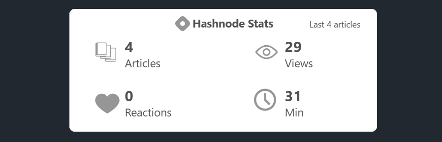

# Hashnode Cards Generator


Automatically generate SVG cards from your latest Hashnode articles and update your README with them using a GitHub Action.

## ✨ Features

- 📡 Fetches latest articles from Hashnode API
- 🎨 Generate customizable SVG article cards
- 🧩 Multiple card types:
  - `large` (vertical)
  - `horizontal`
- 📊 Optional Hashnode stats card
- 🔄 Automatically updates `README.md`
- 📌 Marker-based content injection
- 🧼 Structured and readable action logs
- ⚡ Partial or full stats calculation modes
- ⚠️ Robust error handling with clear feedback

## 📸 Preview

### Large card


### Horizontal card


### Stats card



## 📦 Quick Setup

### 1. Add markers to your README

Your profile README (or any README where you want to display the cards) must contain the following markers:

```markdown
<!-- HASHNODE-CARDS:START -->
<!-- HASHNODE-CARDS:END -->
```

The action will automatically replace the content between these markers.

### 2. Create workflow file

Create a workflow file at `.github/workflows/hashnode-cards.yml` in your repository.

```yaml
name: GitHub Readme Hashnode Cards

on:
  # Schedule the workflow to run every month at midnight UTC
  schedule:
    - cron: "0 0 1 * *"
  # Allow manual triggering of the workflow
  workflow_dispatch:

permissions:
  contents: write

jobs:
  update-readme:
    runs-on: ubuntu-latest
    timeout-minutes: 5

    steps:
      - name: Checkout Repository
        uses: actions/checkout@v6

      - name: Generate Hashnode Cards
        uses: Saul-Lara/hashnode-cards@v1
        with:
          hashnode_blog_host: ${{ vars.HASHNODE_BLOG_HOST }}
          max_cards_to_generate: 4
          card_type: horizontal
          hashnode_stats: true
          hashnode_stats_mode: partial
```

### 3. Configure variables

Go to Settings → Secrets and variables → Actions → Variables.

| Name                 | Description             | Example             |
| -------------------- | ----------------------- | ------------------- |
| `HASHNODE_BLOG_HOST` | Your Hashnode blog host | `blog.hashnode.dev` |

### 4. Run the workflow

The cron expression in the example is set to run every month at midnight (UTC).

For the first run, you can trigger it manually:
Go to the **Actions** tab → Select the workflow → Click **Run workflow**.

---

## ⚙️ Configuration Options

### Inputs

| Input                   | Description                         | Required | Default   |
| ----------------------- | ----------------------------------- | -------- | --------  |
| `hashnode_blog_host`    | Your Hashnode blog host             | ✅ Yes   | -         |
| `max_cards_to_generate` | Maximum number of cards to generate | ❌ No    | `4`       |
| `card_type`             | Card layout (`large`, `horizontal`) | ❌ No    | `large`   |
| `hashnode_stats`        | Enable stats card                   | ❌ No    | `false`   |
| `hashnode_stats_mode`   | Stats mode: `partial` or `full`     | ❌ No    | `partial` |

### Stats Mode

| Mode      | Description                                      |
| --------- | ------------------------------------------------ |
| `partial` | Uses latest fetched posts (fast ⚡)               |
| `full`    | Fetches all posts using pagination (accurate 📈) |

---

## 🔁 How it works

1. The GitHub Action runs on a schedule or manually.
2. Fetches your latest articles from Hashnode.
3. Generates SVG cards inside a `/cards` directory.
4. (Optional) Generates a stats card
5. Updates your README between predefined markers.
6. Commits and pushes changes automatically.

The action regenerates cards each time it runs, always showing your latest articles.

## :green_book: License

Code in this repository is open-sourced software licensed under the [MIT license](LICENSE).

---

Created by [Saul Lara](https://github.com/Saul-Lara)

Feedback and contributions are welcome 🙌
